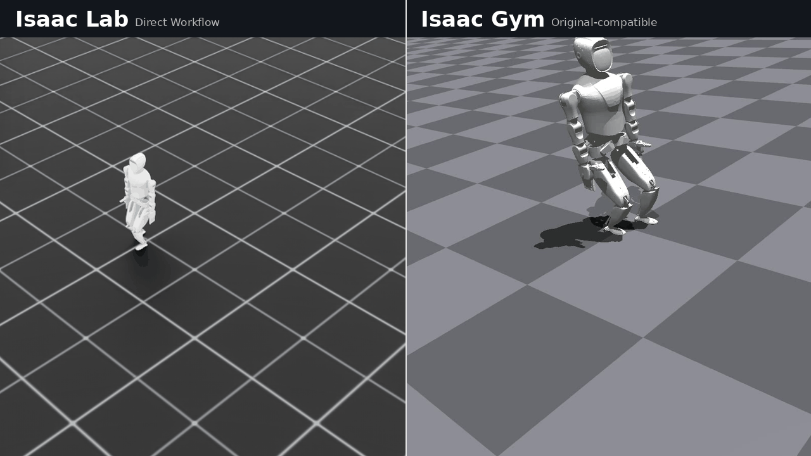
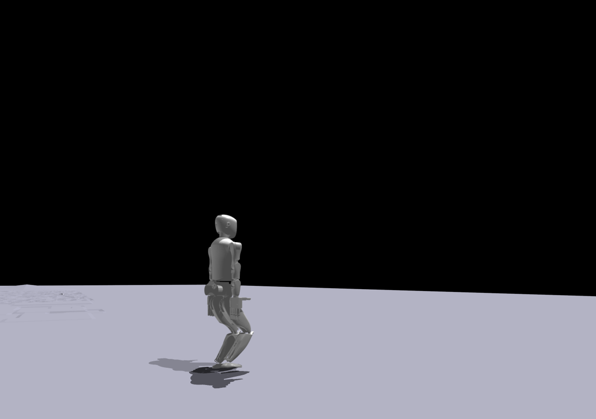
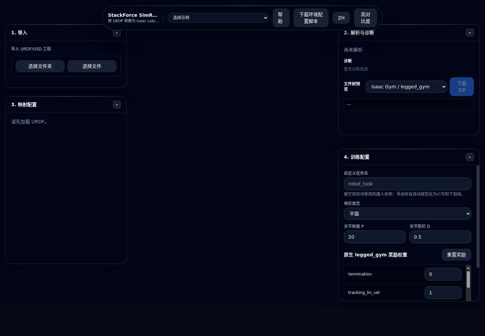

# HumanoidGym-Ex

**中文 | [English](#english)**

HumanoidGym-Ex is not a new humanoid learning framework from scratch. It is a Humanoid-Gym-style extension framework that preserves the original Humanoid-Gym user experience while enabling future Isaac Lab and Genesis backends.

The main work in this repository is the migration of the original Humanoid-Gym codebase plus a Humanoid-Gym-style Isaac Lab Direct backend. Isaac Gym remains the compatibility baseline; Isaac Lab / Isaac Sim is the primary extension path.

HumanoidGym-Ex 是 Humanoid-Gym 库的移植版，它使得 Humanoid-Gym 风格项目可以在目前最新的 Isaac Lab / Isaac Sim 环境上进行训练。原始的老版本 Humanoid-Gym 库只支持 Isaac Gym 训练，在工具链上已经变得老旧，因此我进行了移植，希望能够对大家开发人形机器人有帮助。（原仓库：https://github.com/roboterax/humanoid-gym）。

移植版本被命名为 HumanoidGym-Ex，它保留原版 Humanoid-Gym 的脚本入口、配置方式、reward 写法、PPO 接口和使用习惯，可以同时支持 Isaac Lab 训练和原版 Isaac Gym 的训练与脚本编写方式。你可以直接继承原版 Humanoid-Gym / Legged-Gym 的脚本风格，无缝把原属于 Humanoid-Gym 的 Isaac Gym 训练工程改用 Isaac Lab 进行训练。

为了确保移植的可靠性，我进行了移植版本 HumanoidGym-Ex（在 Isaac Lab 中）和原版 Humanoid-Gym（在 Isaac Gym 中）的训练结果对比，对比表如下：

| 对比项 | 原版 Humanoid-Gym / Isaac Gym | HumanoidGym-Ex / Isaac Lab | 对齐度 / 结论 |
| --- | ---: | ---: | ---: |
| 平地训练规模 | 4096 envs × 60 steps × 1000 iterations | 4096 envs × 60 steps × 1000 iterations | 一致 |
| final reward | 166.8300 | 164.7000 | 98.72% |
| final episode length | 2401.0000 | 2374.0800 | 98.88% |
| final reward / step | 0.069484 | 0.069374 | 99.84% |
| tail10 reward | 165.7760 | 165.1530 | 99.62% |
| tail10 episode length | 2401.0000 | 2384.6570 | 99.32% |
| tail10 reward / step | 0.069045 | 0.069257 | 99.69% |
| 固定命令 replay reward / step | 0.073606 | 0.073871 | 99.64% |
| 固定命令 replay base lin vel x | 0.380029 | 0.369778 | 97.30% |
| 固定命令 replay feet contact rate | 0.538503 | 0.541003 | 99.54% |
| 固定命令 replay done count | 0 | 0 | 100.00% |
| 粗糙地形训练 | rough terrain + terrain curriculum + measured heights | rough terrain + terrain curriculum + measured heights | 支持一致 |
| 粗糙地形 critic obs | 780 | 780 | 一致 |

对比结果表明，移植后的库可以用于接近原版的 Humanoid-Gym 项目在 Isaac Lab / Isaac Sim 上的部署和训练。

本项目由 **灯哥开源** 移植与维护。

- B 站主页：https://space.bilibili.com/493192058
- 迁移目标：让熟悉 Humanoid-Gym 的用户可以用接近原版的方式进入 Isaac Lab / Isaac Sim 生态。

## 效果动图

以下是 HumanoidGym-Ex 在 Isaac Lab 训练后的结果，与 Isaac Gym 原版 Humanoid-Gym 的训练结果并列播放，大家可以直接看到训练效果：



静态截图：

Humanoid-Gym 原版训练后策略播放：



HumanoidGym-Ex 在 Isaac Lab / Isaac Sim 训练后的策略播放：


## 为什么做 HumanoidGym-Ex

原版 Humanoid-Gym 的优点是非常直接：

- `train.py` / `play.py` 脚本中心化，学习成本低。
- robot config、reward scale、observation、reset、command curriculum 都在熟悉的位置。
- reward 函数集中在环境类里，便于调试和快速实验。
- PPO 接口基于 `rsl_rl` 风格，训练链路简单。

Isaac Lab / Isaac Sim 的生态更现代，但它的新工作流（Manager-based workflow）对很多从 Humanoid-Gym / Legged-Gym 迁移过来的用户来说会显得有学习成本，因此我做了这个 HumanoidGym-Ex 项目，实现了在保持原本 Humanoid-Gym 风格工程模式的前提下，把训练器和仿真器从 Isaac Gym 换成 Isaac Lab，使其适用于最新的仿真工具链。同步地，HumanoidGym-Ex 在能够实现 Isaac Lab / Isaac Sim 训练方式的前提下，也同步支持原生 Isaac Gym 的 train 和 play，实现了一套框架同步支持 Isaac Lab / Isaac Sim 和 Isaac Gym 强化学习后端。

## 项目目录结构

```text
humanoid_gym_ex/
├── humanoid_gym_ex/
│   ├── algo/                 # PPO / actor-critic / runner
│   ├── envs/
│   │   ├── base/             # Humanoid-Gym style base env/config/backend interface
│   │   ├── backends/         # Isaac Gym / Isaac Lab / Genesis adapters
│   │   └── robots/           # XBot-L and future humanoids
│   ├── resources/            # URDF / meshes / MuJoCo resources
│   ├── scripts/              # train/play/sim2sim/diagnostics
│   └── utils/
├── docs/
├── images/
├── logs/
└── README.md
```

## 环境安装

### Isaac Gym 环境

HumanoidGym-Ex 支持 Isaac Gym 环境和 Isaac Lab / Isaac Sim 双环境。如果你需要使用 Isaac Gym 来启动训练，安装方式可以参考 Isaac Gym 官方仓库或者我的视频：https://www.bilibili.com/video/BV1kYo8BhEkN/

### Isaac Lab / Isaac Sim 环境

Isaac Lab 可以参考官方安装方式：https://isaac-sim.github.io/IsaacLab/main/source/setup/installation/

## 启动训练--使用 Isaac Lab

这里是基于 Isaac Lab 启动 HumanoidGym-Ex 自带的 XBot-L 机器人例子进行训练的方法。

启动平地训练：

```bash
PYTHONPATH=/path/to/HumanoidGym-Ex \
WANDB_MODE=offline \
conda run -p /path/to/env_isaaclab \
python humanoid_gym_ex/scripts/train_isaaclab.py \
  --headless \
  --num_envs 4096 \
  --num_steps_per_env 60 \
  --max_iterations 1000 \
  --seed 42 \
  --run_name xbot_isaaclab_1000 \
  --device cuda:0
```

### 启动粗糙地形训练

```bash
PYTHONPATH=/path/to/HumanoidGym-Ex \
WANDB_MODE=offline \
conda run -p /path/to/env_isaaclab \
python humanoid_gym_ex/scripts/train_isaaclab.py \
  --headless \
  --num_envs 4096 \
  --num_steps_per_env 60 \
  --max_iterations 1000 \
  --seed 42 \
  --run_name rough_heights_curric_lab \
  --terrain rough \
  --measure_heights \
  --terrain_curriculum \
  --device cuda:0
```

### Isaac Lab 上进行训练结果播放

```bash
PYTHONPATH=/path/to/HumanoidGym-Ex \
conda run -p /path/to/env_isaaclab \
python humanoid_gym_ex/scripts/play_isaaclab.py \
  --load_run <run_dir_name> \
  --checkpoint 1000 \
  --fix_command \
  --follow_camera \
  --terrain rough \
  --measure_heights \
  --terrain_curriculum \
  --device cuda:0
```

### 启动训练--使用 Isaac Gym

这里是启动 HumanoidGym-Ex 自带的 XBot-L 机器人例子进行训练的方法，基于 Isaac Gym，这体现了 HumanoidGym-Ex 同时兼容 Isaac Lab 和 Isaac Gym 的特性。

```bash
python humanoid_gym_ex/scripts/train.py \
  --task=humanoid_ppo \
  --headless \
  --num_envs 4096 \
  --max_iterations 1000 \
  --run_name xbot_isaacgym_1000 \
  --sim_device cuda:0 \
  --rl_device cuda:0
```

### 启动粗糙地形训练

```bash
python humanoid_gym_ex/scripts/train.py \
  --task=humanoid_ppo \
  --headless \
  --num_envs 4096 \
  --max_iterations 1000 \
  --run_name rough_heights_curric_gym \
  --terrain rough \
  --measure_heights \
  --terrain_curriculum \
  --sim_device cuda:0 \
  --rl_device cuda:0
```

### Isaac Gym 上进行训练结果播放

```bash
python humanoid_gym_ex/scripts/play.py \
  --task=humanoid_ppo \
  --load_run <run_dir_name> \
  --checkpoint 1000
```

### 当用粗糙地形进行训练时，用这样的方式启动

```bash
HUMANOID_GYM_EX_EXPORT_POLICY=0 \
HUMANOID_GYM_EX_RENDER=0 \
HUMANOID_GYM_EX_PLOT_STATES=0 \
HUMANOID_GYM_EX_FOLLOW_CAMERA=1 \
python humanoid_gym_ex/scripts/play.py \
  --task=humanoid_ppo \
  --load_run <run_dir_name> \
  --checkpoint 1000 \
  --terrain rough \
  --measure_heights \
  --terrain_curriculum
```

## StackForce Sim Ready

HumanoidGym-Ex 框架也可以在我的一键强化学习工程生成器 StackForce Sim Ready 上作为生成框架使用：http://sim.stackforce.cc

StackForce Sim Ready 是我开发的一个方便快速生成强化学习工程的工具，只需要给定 USD / URDF 文件，就能够一键生成可以用于强化学习训练的强化学习工程，0 代码实现强化学习训练。



## 致谢与声明

本项目基于原版 `roboterax/humanoid-gym` 进行迁移和扩展，并保留迁移源文件中的 BSD-3-Clause license headers。

特别感谢：

- Humanoid-Gym 原作者与 RobotEra XBot-L 示例。
- Legged-Gym / `rsl_rl` 生态。
- NVIDIA Isaac Gym、Isaac Lab、Isaac Sim。
- 灯哥

灯哥开源 B 站视频号：

https://space.bilibili.com/493192058

---

<a id="english"></a>

# HumanoidGym-Ex English README

HumanoidGym-Ex is not a new humanoid learning framework from scratch. It is a Humanoid-Gym-style extension framework that preserves the original Humanoid-Gym user experience while enabling future Isaac Lab and Genesis backends.

The main work in this repository is the migration of the original Humanoid-Gym codebase plus a Humanoid-Gym-style Isaac Lab Direct backend. Isaac Gym remains the compatibility baseline; Isaac Lab / Isaac Sim is the primary extension path.

HumanoidGym-Ex is a migrated version of the original [Humanoid-Gym](https://github.com/roboterax/humanoid-gym). It enables Humanoid-Gym-style projects to train in the newer Isaac Lab / Isaac Sim environment. The original Humanoid-Gym mainly supports Isaac Gym, whose toolchain is becoming old, so this project migrates the workflow to help humanoid robot developers.

The migrated version is named HumanoidGym-Ex. It preserves the original Humanoid-Gym script entry points, configuration style, reward style, PPO interface, and usage habits. It supports both Isaac Lab training and the original Isaac Gym training workflow. Users can keep the original Humanoid-Gym / Legged-Gym scripting style and move Isaac Gym-based Humanoid-Gym projects to Isaac Lab.

To verify the migration, I compared the training results of HumanoidGym-Ex in Isaac Lab with the original Humanoid-Gym style training results in Isaac Gym:

| Item | Original Humanoid-Gym / Isaac Gym | HumanoidGym-Ex / Isaac Lab | Alignment / Result |
| --- | ---: | ---: | ---: |
| Plane training scale | 4096 envs × 60 steps × 1000 iterations | 4096 envs × 60 steps × 1000 iterations | Same |
| final reward | 166.8300 | 164.7000 | 98.72% |
| final episode length | 2401.0000 | 2374.0800 | 98.88% |
| final reward / step | 0.069484 | 0.069374 | 99.84% |
| tail10 reward | 165.7760 | 165.1530 | 99.62% |
| tail10 episode length | 2401.0000 | 2384.6570 | 99.32% |
| tail10 reward / step | 0.069045 | 0.069257 | 99.69% |
| fixed-command replay reward / step | 0.073606 | 0.073871 | 99.64% |
| fixed-command replay base lin vel x | 0.380029 | 0.369778 | 97.30% |
| fixed-command replay feet contact rate | 0.538503 | 0.541003 | 99.54% |
| fixed-command replay done count | 0 | 0 | 100.00% |
| Rough-terrain training | rough terrain + terrain curriculum + measured heights | rough terrain + terrain curriculum + measured heights | Supported on both |
| Rough-terrain critic obs | 780 | 780 | Same |

The comparison shows that the migrated library can be used to deploy and train Humanoid-Gym-style projects on Isaac Lab / Isaac Sim in a way close to the original workflow.

This project is migrated and maintained by **Deng Ge Open Source**.

- Bilibili: https://space.bilibili.com/493192058
- Migration goal: let users familiar with Humanoid-Gym enter the Isaac Lab / Isaac Sim ecosystem in a way close to the original project.

## Demo

The following animation shows HumanoidGym-Ex trained in Isaac Lab side by side with the original Humanoid-Gym-style result trained in Isaac Gym:


Static screenshots:

Original Humanoid-Gym policy playback in Isaac Gym:


HumanoidGym-Ex policy playback after training in Isaac Lab / Isaac Sim:


## Why HumanoidGym-Ex

The original Humanoid-Gym is direct and easy to use:

- `train.py` / `play.py` are script-centered and easy to learn.
- robot config, reward scale, observation, reset, and command curriculum are easy to find.
- reward functions are centralized in the environment class, which is convenient for debugging and quick experiments.
- the PPO interface follows the `rsl_rl` style, keeping the training pipeline simple.

Isaac Lab / Isaac Sim has a more modern ecosystem, but its newer Manager-based workflow can add learning cost for users migrating from Humanoid-Gym / Legged-Gym. HumanoidGym-Ex keeps the original Humanoid-Gym-style project structure while changing the simulator and training backend from Isaac Gym to Isaac Lab. At the same time, HumanoidGym-Ex still supports native Isaac Gym train and play scripts, so one framework supports both Isaac Lab / Isaac Sim and Isaac Gym reinforcement learning backends.

## Project Layout

```text
humanoid_gym_ex/
├── humanoid_gym_ex/
│   ├── algo/                 # PPO / actor-critic / runner
│   ├── envs/
│   │   ├── base/             # Humanoid-Gym style base env/config/backend interface
│   │   ├── backends/         # Isaac Gym / Isaac Lab / Genesis adapters
│   │   └── robots/           # XBot-L and future humanoids
│   ├── resources/            # URDF / meshes / MuJoCo resources
│   ├── scripts/              # train/play/sim2sim/diagnostics
│   └── utils/
├── docs/
├── images/
├── logs/
└── README.md
```

## Installation

### Isaac Gym

HumanoidGym-Ex supports both Isaac Gym and Isaac Lab / Isaac Sim. If you need to train with Isaac Gym, follow the official Isaac Gym installation or this video: https://www.bilibili.com/video/BV1kYo8BhEkN/

### Isaac Lab / Isaac Sim

For Isaac Lab, follow the official installation documentation: https://isaac-sim.github.io/IsaacLab/main/source/setup/installation/

## Training With Isaac Lab

This is how to train the built-in XBot-L example in HumanoidGym-Ex with Isaac Lab.

Plane training:

```bash
PYTHONPATH=/path/to/HumanoidGym-Ex \
WANDB_MODE=offline \
conda run -p /path/to/env_isaaclab \
python humanoid_gym_ex/scripts/train_isaaclab.py \
  --headless \
  --num_envs 4096 \
  --num_steps_per_env 60 \
  --max_iterations 1000 \
  --seed 42 \
  --run_name xbot_isaaclab_1000 \
  --device cuda:0
```

### Rough-terrain training

```bash
PYTHONPATH=/path/to/HumanoidGym-Ex \
WANDB_MODE=offline \
conda run -p /path/to/env_isaaclab \
python humanoid_gym_ex/scripts/train_isaaclab.py \
  --headless \
  --num_envs 4096 \
  --num_steps_per_env 60 \
  --max_iterations 1000 \
  --seed 42 \
  --run_name rough_heights_curric_lab \
  --terrain rough \
  --measure_heights \
  --terrain_curriculum \
  --device cuda:0
```

### Playing Isaac Lab results

```bash
PYTHONPATH=/path/to/HumanoidGym-Ex \
conda run -p /path/to/env_isaaclab \
python humanoid_gym_ex/scripts/play_isaaclab.py \
  --load_run <run_dir_name> \
  --checkpoint 1000 \
  --fix_command \
  --follow_camera \
  --terrain rough \
  --measure_heights \
  --terrain_curriculum \
  --device cuda:0
```

### Training With Isaac Gym

This is how to train the built-in XBot-L example in HumanoidGym-Ex with Isaac Gym, showing that HumanoidGym-Ex supports both Isaac Lab and Isaac Gym.

```bash
python humanoid_gym_ex/scripts/train.py \
  --task=humanoid_ppo \
  --headless \
  --num_envs 4096 \
  --max_iterations 1000 \
  --run_name xbot_isaacgym_1000 \
  --sim_device cuda:0 \
  --rl_device cuda:0
```

### Rough-terrain training

```bash
python humanoid_gym_ex/scripts/train.py \
  --task=humanoid_ppo \
  --headless \
  --num_envs 4096 \
  --max_iterations 1000 \
  --run_name rough_heights_curric_gym \
  --terrain rough \
  --measure_heights \
  --terrain_curriculum \
  --sim_device cuda:0 \
  --rl_device cuda:0
```

### Playing Isaac Gym results

```bash
python humanoid_gym_ex/scripts/play.py \
  --task=humanoid_ppo \
  --load_run <run_dir_name> \
  --checkpoint 1000
```

### Playing rough-terrain results

```bash
HUMANOID_GYM_EX_EXPORT_POLICY=0 \
HUMANOID_GYM_EX_RENDER=0 \
HUMANOID_GYM_EX_PLOT_STATES=0 \
HUMANOID_GYM_EX_FOLLOW_CAMERA=1 \
python humanoid_gym_ex/scripts/play.py \
  --task=humanoid_ppo \
  --load_run <run_dir_name> \
  --checkpoint 1000 \
  --terrain rough \
  --measure_heights \
  --terrain_curriculum
```

## StackForce Sim Ready

HumanoidGym-Ex can also be used as a generated framework in my one-click reinforcement learning project generator, StackForce Sim Ready: http://sim.stackforce.cc

StackForce Sim Ready is a tool I developed for quickly generating reinforcement learning projects. Given a USD / URDF file, it can generate a reinforcement learning project for training with one click, enabling zero-code reinforcement learning training.


## Credits

This project is migrated and extended from the original `roboterax/humanoid-gym`, and keeps the BSD-3-Clause license headers in migrated source files.

Special thanks to:

- the original Humanoid-Gym authors and the RobotEra XBot-L example
- Legged-Gym / `rsl_rl`
- NVIDIA Isaac Gym, Isaac Lab, and Isaac Sim
- Deng Ge

Deng Ge Open Source Bilibili:

https://space.bilibili.com/493192058
